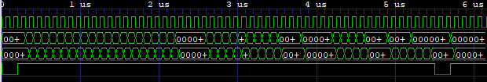
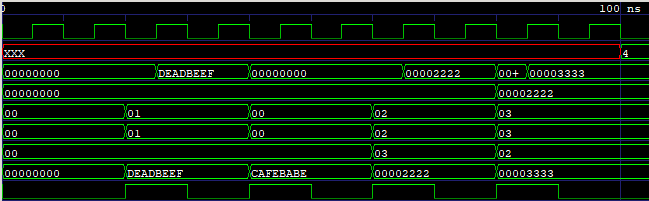

# 32-Bit RISC-V CPU with TJ Language Compiler
A complete single-cycle 32-bit RISC-V processor implementation with a custom high-level programming language compiler.

## Features

### 🖥️ RISC-V CPU Core
- **Architecture**: Single-cycle Harvard architecture
- **Data Width**: 32-bit
- **Memory**: 1KB instruction memory, 1KB data memory
- **Instruction Set**: R-type (ADD, SUB, AND, OR, SLT), I-type (LW), S-type (SW), B-type (BEQ)

### 🔧 Custom TJ Language & Compiler
- **File Extension**: `.tj` (personalized language)
- **Syntax**: Human-readable C-like syntax
- **Compiler**: Python-based with complete lexer, parser, and code generator
- **Output**: RISC-V machine code in hex format

## Compiler

### Supported Instructions
| Type | Instruction | TJ Syntax | Description |
|------|-------------|-----------|-------------|
| R-type | ADD | `r1 = r2 + r3` | Addition |
| R-type | SUB | `r1 = r2 - r3` | Subtraction |
| R-type | AND | `r1 = r2 & r3` | Bitwise AND |
| R-type | OR | `r1 = r2 \| r3` | Bitwise OR |
| R-type | SLT | `r1 = r2 < r3` | Set Less Than |
| I-type | LW | `r1 = memory[0]` | Load Word |
| S-type | SW | `memory[0] = r1` | Store Word |
| B-type | BEQ | `if r1 == r2:` | Branch if Equal |

### Waveform Analysis

The following waveforms demonstrate the CPU operation during simulation:

#### Program Counter Operation

*Program counter incrementing through instruction addresses and branch behavior*

#### Register File Operations  

*Register file read/write operations showing data flow through the CPU*

#### Instruction Memory Access

*Instruction fetch cycles from Harvard architecture instruction memory*

#### Data Memory Operations

*Load and store operations demonstrating data memory access patterns*

## Development Tools

### Required Software
- **Xilinx Vivado**: For SystemVerilog simulation
- **Python**: For TJ language compiler

## Author

**TJ** - Custom RISC-V CPU and TJ Language implementation

---
